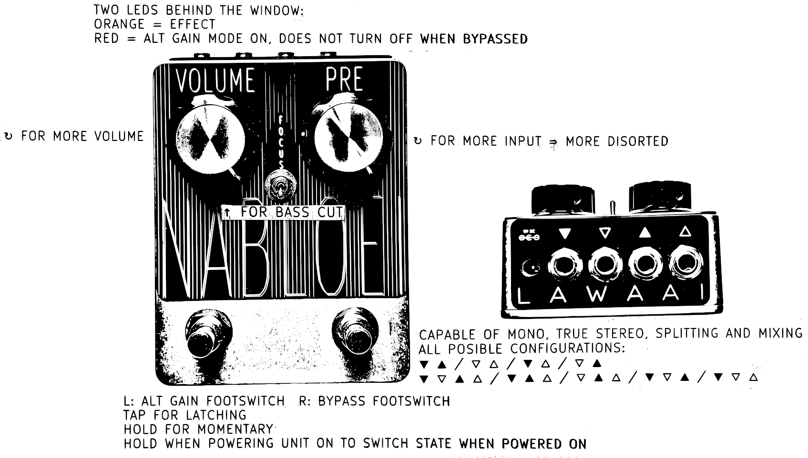

# ReadMe #
This repository provides:
- the full KiCad project, including gerbers plotted to the specifications of JLCPCB
- a PDF of the schematic for those who do not use KiCad
- the Arduino code
- a PNG of the user manual like bellow

The gerbers, pdf schematic and firmware are not located under the code tab but can be downloaded in releases.

All of this documentation is free for you to use, all I ask is that no direct copies of this pedal are made for sale.

Thank you.

LAWAAI